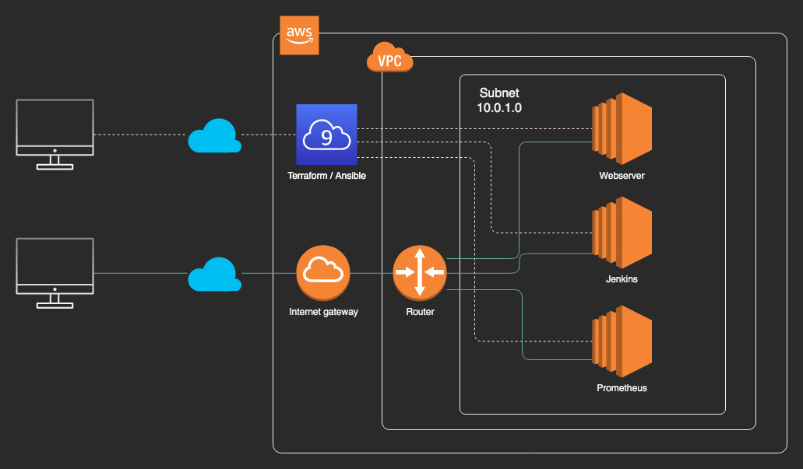

# DevOpsTool2020

## 構成図


## Cloud9の環境作成
まずはAWSのコンソール画面からCloud9の環境を作成してください。
基本的に設定するのは名前くらいで、他の項目はデフォルトで構いません。

### Terraformをインストールする
1. ダウンロード(最新バージョンをダウンロードしてください)
```
wget https://releases.hashicorp.com/terraform/0.13.0/terraform_0.13.0_linux_amd64.zip
```
2. 解凍
```
unzip terraform_0.13.0_linux_amd64.zip
```
3. 実行ファイルを移動
```
mv terraform ~/.local/bin/
```
4. バージョンの確認
```
terraform -v
```

### Ansibleをインストールする
1. インストール
```
pip install --user ansible
```
2. バージョンの確認
```
ansible --version
```

### terraform/ansibleのコマンドが見つからないときは
シェルのキャッシュをクリアする
```
hash -r
```

## 構築手順

### キーペアを作成する
以下のコマンドで公開鍵と秘密鍵の２ファイルを作成します。

```
$ ssh-keygen -t rsa -f id_rsa -N ''
```

### 変数ファイルを作成する
variables.tfに変数定義をしているので変更したい変数はterraform.tfvarsで書き換えます。

例

```
$ less terraform.tfvars
key_name = "hoge"
```

### クレデンシャル情報を設定する

```
$ export AWS_ACCESS_KEY_ID=XXXXXXXXXXXXXXX
$ export AWS_SECRET_ACCESS_KEY=xxxxxxxxxxxxxxx
```

#### dockerの場合は
terraform.envを用意してください。

```
$ cat terraform.env
AWS_ACCESS_KEY_ID=XXXXXXXXXXXXXXX
AWS_SECRET_ACCESS_KEY=xxxxxxxxxxxxxxx
```

### リソースの作成/削除
初期化

```
$ terraform init
```

Dry-run

```
$ terraform plan
```

リソースを作成する

```
$ terraform apply
```

リソースを削除する

```
$ terraform destroy
```

#### dockerだったら
docker-compose.ymlとMakefileを用意しているので、以下のコマンドでOK。

初期化

```
$ make init
```

Dry-run

```
$ make plan
```

リソースを作成する

```
$ make apply
```

リソースを削除する

```
$ make destroy
```

terraformコマンドを実行せずコンテナの中に入る

```
$ make sh
```

### インスタンスへSSH接続する
最初に作成したキーペアの秘密鍵を指定してSSH接続する。ホスト名は作成したパプリックDNSを指定する。

```
$ ssh -i ./id_rsa ec2-user@<public dns>
```

あるいは、AWSダッシュボードからEC2 Instant Connectを使ってもOK。

インスタンス > インスタンスを選択する > 接続 > EC2 Instance Connectを選択 > 接続 > ポップアップが表示される

### Ansibleサーバーから別のサーバーへSSH接続する
Ansibleサーバーにはキーペアがコピーされているので別サーバーへSSH接続が可能です。

```
$ ssh ec2-user@<別サーバーのpublic dns>
```
